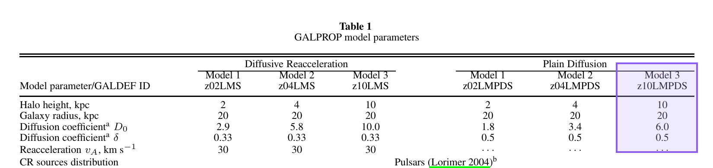
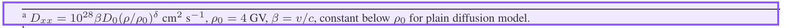
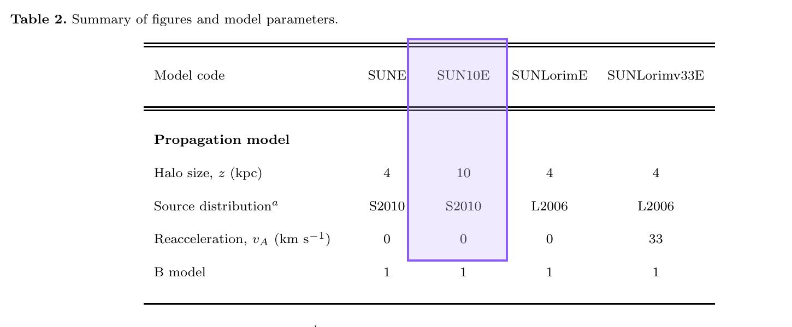

# Paper Claim Audit

`paper-claim-audit` 用来核查科学论文中的主张、数值参数和模型设置。它默认先检索同版本 arXiv 源码，再用 PDF 复核最终排版，并把决定性原文直接做成带淡紫色标注的证据图。

最终结果不只给论文链接，还会区分论文原话、被引用的前序输入、当前项目配置、代码执行语义和独立推断。

## 使用

直接告诉 Codex：

```text
使用 $paper-claim-audit 核查 GALPROP 中这个扩散系数的来源，并给出原文证据。
```

涉及“参数是否真的来自这篇论文”“论文和代码是否一致”“沿引用链追踪模型设置”等问题时，也可以自动触发。

一次完整输出应包含：结论与置信度、带标注的 PDF 原文、准确定位、源码复核结果、每项证据能支持和不能支持的内容，以及仍未解决的冲突。

## 真实案例：GALPROP 扩散系数

我们实际核查的问题是：Strong et al. (2010) 的 `z10LMPDS` 如何定义扩散系数，Orlando & Strong (2013) 的 `SUN10E` 是否继承了这套传播设置。

**结论：** `z10LMPDS` 是 halo half-height 为 10 kpc 的 plain-diffusion 模型。表中给出 `D0 = 6.0`，单位因子为 `10^28 cm^2 s^-1`，参考刚度为 4 GV，刚度指数为 `0.5`，公式保留 `beta = v/c`；参考刚度以下固定刚度幂律因子。`SUN10E` 使用 10 kpc halo、S2010 源分布且不使用再加速。

**置信度：高。** 这是对论文模型定义和采用关系的确认；它不表示这组参数是银河系扩散的唯一物理真值，也不能仅凭论文证明任意当前配置确实执行了它。

**1. Strong2010 的目标参数列**



[PDF 第 4 页，Table 1](https://arxiv.org/pdf/1008.4330v1) · [未标注原图](assets/galprop-diffusion-strong2010-parameters.raw.png) · [哈希与渲染清单](assets/galprop-diffusion-strong2010-parameters.json)

这张图直接确定模型列、10 kpc halo、`D0 = 6.0`、`delta = 0.5` 和无再加速。它没有给全 `D0` 的单位及低刚度定义，因此还需要下一条脚注。

**2. 同表脚注中的扩散公式**



[PDF 第 4 页，Table 1 脚注 a](https://arxiv.org/pdf/1008.4330v1) · [未标注原图](assets/galprop-diffusion-strong2010-formula.raw.png) · [哈希与渲染清单](assets/galprop-diffusion-strong2010-formula.json)

这张图补齐单位因子、速度因子、4 GV 参考刚度和低刚度规则。同版本 `ms.tex` 中的 `tablenotetext{a}` 与 PDF 一致。

**3. Orlando2013 中的采用关系**



[PDF 第 11 页，Table 2](https://arxiv.org/pdf/1309.2947v2) · [未标注原图](assets/galprop-diffusion-orlando2013-sun10e.raw.png) · [哈希与渲染清单](assets/galprop-diffusion-orlando2013-sun10e.json)

这张图确认 `SUN10E` 的 10 kpc halo、S2010 源分布和零再加速；同版本源码正文把其注入谱和源分布连接到 Strong2010 的 LMPDS。Table 2 没有重列 `D0` 和 `delta`，所以这两个数值必须与前两条证据联合使用。

完整证据链是：

```text
Orlando2013 SUN10E
  -> Orlando2013 源码中的 Strong2010/LMPDS 采用说明
  -> Strong2010 z10LMPDS 参数列
  -> Strong2010 公式脚注
  -> 具体项目的配置与实现代码（应用时另查）
```

## 核查规则

- arXiv 源码负责精确检索，必须由同版本 PDF 确认最终内容和上下文。
- 元数据和搜索摘要只用于发现论文，不能作为正文证据。
- PDF 能证明作者写了什么；项目配置和实现代码决定当前程序实际做了什么。
- 每张证据图都说明其支持范围和证据边界，避免单图过度推断。
- 标注图同时保留 `.raw.png` 和 JSON 清单；清单记录 PDF、页码、裁剪、渲染、高亮参数及图片哈希。
- 证据不足时返回 `unresolved`，不用记忆或方便的数值补齐缺口。

默认高亮使用淡紫色填充 `#C4B5FD`、透明度 `0.28`、边框 `#8B5CF6`。高亮仅是展示层，不改变作为视觉原件的未标注裁剪。

## 安装与仓库

把本仓库链接发给 Codex，并让它安装 `paper-claim-audit`；agent 会调用 skill 安装流程并检查所需依赖，无需手工复制文件。

仓库包含 [`SKILL.md`](SKILL.md)、[核查流程](references/source-pdf-workflow.md)、[报告模板](references/report-template.md) 和 [无头服务器 PDF 证据图脚本](scripts/render_pdf_evidence.py)。渲染脚本使用 Poppler；添加高亮时需要 Pillow。

该 skill 也收录在 [SOYONAOC/codex-skills](https://github.com/SOYONAOC/codex-skills) 合集仓库中。
